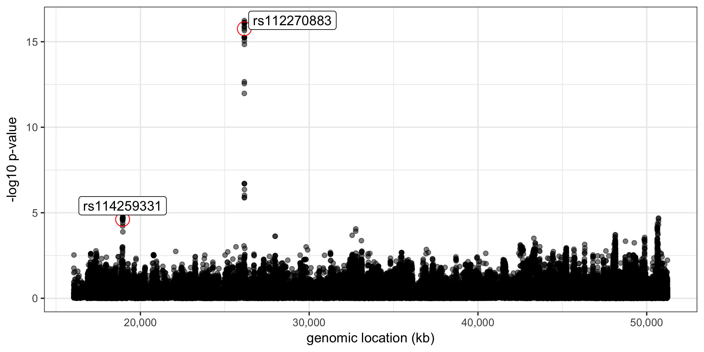
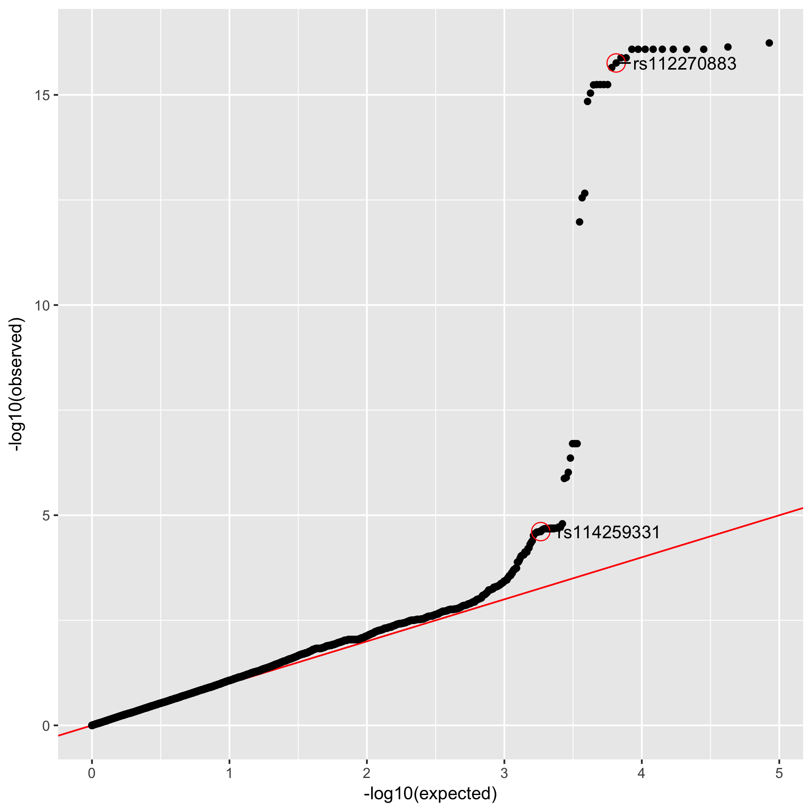

If you want to see equations, please see the PDF version of this document, produced by [pandoc](https://pandoc.org/).

# Introduction

In this lab, we will learn basic concepts of genome-wide association
studies through realistic simulations.  For simplicity we assume a
linear model that describes a phenotype vector as a linear combination
of multiple genotype vectors (still widely accepted in most researches).
We will explore the impacts of the following simulation parameters:

* Effect size (~ regression coefficients) and number of causal variants

* Heritability ($h^2$; h2)

* Linkage disequilibrium structure

If you are familiar with `R`, you can start your experiments modifying
the script `lab2.R` in this directory, but any other language will
work as well.

# Simulation of phenotype data

We will use the genotype matrix of 1000 genomes project (Lab \#1).

## Loading genotype dosage matrix

- We only deal with biallelic variants (two possibilities of haplotype).

- We assume an additive model, which renders encoding of each variant by 0, 1, or 2 for diploid.

- We will use precompiled chromosome 22 data `chr22.Rd`

```
load('chr22.Rd') # will have plink object
```

- Here, we use standardized genotype matrix for simplicity (mean = 0 and variance = 1 for all variants)

```
## Just give names
colnames(plink$BIM) <- c('chr', 'rs', 'missing', 'snp.loc', 'plink.a1', 'plink.a2')

## Standardize genotype matrix and replace NAs with zeros
## check dim(X): individual x SNP matrix
X <- plink$BED %>% scale() %>% rm.na.zero()
n.snps <- ncol(X)
n.ind <- nrow(X)
```

- If you want to break LD structure while preserving the same distribution of minor allele frequency:

```
X.noLD <- apply(X, 2, function(x) x[sample(n.ind)])
```


## Simulation of quantitative trait

### Generative model

We assume genotype matrix `X` is standardized to simplify the
equations.  Here we use $n$ for number of individuals and $p$ for
total number of SNPs. We can generate phenotype for an individual $i$
as

$$y_{i} = \sum_{j=1}^{p} X_{ij} \beta_{j} + \epsilon_{i}$$

where $K$ of $\beta_{j}$ take a non-zero value;
$\epsilon_{i}$ represents non-genetic noise on that sample $i$.
Additionally we assume independent noise sampled from Normal
distribution with the variance parameter $\sigma^{2}$ shared across
all individuals

$$\epsilon_{i} \sim \mathcal{N}\!\left(0, \sigma^{2}\right)$$

and causal variant effect sizes also follow Normal distribution

$$\beta_{j} \sim \mathcal{N}\!\left(0, \tau_{j}^{2}\right).$$

You can also think that non-causal variants $\tau_{j} = 0$.  We can
fully describe our simulation with

* K : number of causal variant

* $\sigma^{2}$ : non-genetic variance parameter

* $\tau^{2}$ : genetic effect size variance parameter

Now the question is how do we set $\sigma^{2}$ and $\tau^{2}$ given K.

### Heritability

We will introduce the concept of heritability (narrow sense) and use
it to set $\sigma^{2}$ and $\tau^{2}$.  Here, we define the heritability parameter as
ratio of genetic variance to total variance.  We simply decompose
total variance into genetic and non-genetic components.  More
precisely, we define

$$h_{g}^{2} \equiv \frac{\mathbb{V}[X\beta]}{\mathbb{V}[y]} = \frac{\mathbb{V}[X\beta]}{\mathbb{V}[X\beta] + \mathbb{V}[\epsilon]}.$$

Assuming causal variants and individuals are independent, for each
causal variant $j$, we can derive variance of effects of this causal
variant $\beta_{j}$ on $n$ individuals as:

$$\mathbb{V}[\sum_{i=1}^{n} X_{ij} \beta_{j}] = \sum_{i=1}^{n} X_{ij}^{2} \mathbb{V}[\beta_{j}] = n \tau^{2}_{j}$$

And remaining non-genetic component we have:

$$\mathbb{V}[\sum_{i=1}^{n} \epsilon_{i}] = n \sigma^{2}$$

Now, back to the problem of setting $\tau^{2}$ and $\sigma^{2}$ values.  Given a $h^{2}$ value, we want to achieve

$$h^{2} = \frac{n \sum_{j} \tau_{j}^{2}}{n \sum_{j} \tau_{j}^{2} + n \sigma^{2}} = 
\frac{K \tau^{2}}{K \tau^{2} + \sigma^{2}}$$

where we simplified that causal variants share the same variance parameter ($\tau^{2}$).
We can easily fill in $\tau^{2}$, $\sigma^{2}$ values by setting:

$$\tau^{2} \gets h^{2} / K,\, \sigma^{2} \gets 1 - h^{2}$$

Therefore we can start simulation first sampling causal effect size:
$\beta_{j} \sim \mathcal{N}\!\left(0, h^{2} / K\right)$
and then sampling isotropic noise:
$\epsilon_{i} \sim \mathcal{N}\!\left(0, 1 - h^{2}\right)$.

### Implementation

For your convenience, you can use the following function implemented in `lab2-functions.R`

```
## X        = individual x SNP genotype matrix
## n.causal = number of causal SNPs
## h2       = assumed heritability
## n.pheno  = number of phenotypes (traits)
simulate.phenotype <- function(X, n.causal, h2, n.pheno = 1) {

    Y <- matrix(NA, nrow = nrow(X), n.pheno)
    causal <- NULL

    for(j in 1:n.pheno) {
        causal.pos <- sample(n.snps, n.causal) # causal variant
        effect <- rnorm.mat(n.causal, 1) * sqrt(h2 / n.causal) # effect size
        y.hat <- X[, causal.pos, drop = FALSE] %*% effect
        y.err <- rnorm.mat(n.ind, 1) * sqrt(1 - h2)
        y <- y.hat + y.err
        
        Y[, j] <- y
        causal <- rbind(causal, data.frame(x.pos = causal.pos, y.col = j))
    }
    
    ret <- list(y = Y, causal = causal)
}
```


## Genetic association

### SNP-by-SNP Association test

Without environmental covariates, we assume the following linear model:

$$y \sim \mathbf{x}_{j} \beta_{j} + \epsilon$$

We want to test whether $\beta$ takes zero or non-zero.  More formally,

$$H_{0}: \beta_{j} = 0 \, H_{1}: \beta_{j} \neq 0$$

We can use test statistic (z-score) $Z = \mathbb{E}[\beta_{j}] /
\sqrt{\mathbb{V}[\beta_{j}]}$ to check significant deviation from zero.
But we do not know true mean and variance, so we estimate from the
data.

Since we have standardized the genotype matrix (column-wise) and there
is no intercept term in the linear model,

$$\hat{\beta}_{j} = \frac{\sum_{i} X_{ij} y_{i}}{\sum_{i} X_{ij}^{2}} = \frac{\sum_{i} X_{ij} y_{i}}{n}$$

with the variance

$$\mathbb{V}[\hat\beta_{j}] = \frac{\sum_{i}\mathbb{V}[\epsilon_{i}]}{\sum_{i} X_{ij}^{2}}
= \frac{\sum_{i} (y_{i} - X_{ij} \hat{\beta}_{j})^{2} / (n - 1)}{n}$$

If you are not sure, you can quickly review (or learn) 
[here](https://en.wikipedia.org/wiki/Simple_linear_regression).

### Implementation

```
################################################################
## Calculation of SNP-by-SNP QTL statistics
##
## convert z-score to p-values (two-sided test)
zscore.pvalue <- function(z) {
    2 * pnorm(abs(z), lower.tail = FALSE)
}
## calculate univariate effect sizes and p-values
calc.qtl.stat <- function(xx, yy) {

    require(dplyr)
    require(tidyr)

    .xx <- scale(xx)
    .yy <- scale(yy)

    ## cross-product is much faster than covariance function
    n.obs <- crossprod(!is.na(.xx), !is.na(.yy))
    beta.mat <- crossprod(.xx %>% rm.na.zero(), .yy %>% rm.na.zero()) / n.obs

    ## residual standard deviation
    resid.se.mat <- matrix(NA, ncol(.xx), ncol(.yy))

    for(k in 1:ncol(.yy)) {

        beta.k <- beta.mat[, k]
        yy.k <- .yy[, k]
        err.k <- sweep(sweep(.xx, 2, beta.k, `*`), 1, .yy, `-`)
        se.k <- apply(err.k, 2, sd, na.rm = TRUE)

        resid.se.mat[, k] <- se.k
    }

    (...)
}
```

### Visualization 1 : Manhattan plot

Often, GWAS results are presented as so called "Manhattan plot":



### Visualization 2 : QQ plot

Also, it is useful to visualize the results as a quantile-quantile
plot, checking that most of SNPs are described by the null hypothesis
(diagonal).  If not GWAS, results can be either polygenic (a large of
number of causal SNPs) or statistics are inflated due to unknown
hidden confounding variables (which is bad).



## Assignment

1. Simulate and generate GWAS statistics using 1000 genomes genotype
   matrix (chr22). Make plots or tables and interpret the results.

    - Generate data with different configuration of simulation parameters

    - Run GWAS within `R` or your favorite environment

    - (optional) Run GWAS using [PLINK](https://www.cog-genomics.org/plink2)

2. Repeat the same type of experiments breaking the correlation structure between the variants (LD).


3. Simulate case/control GWAS data. Make plots or tables and interpret the results.

    - Generate binary phenotype vectors with different threshold value $\theta$.  E.g., setting $y_{i} = 1$ if $\sum_{j} X_{ij} \beta_{j}$ is greater than $\theta$; $y_{i} = 0$ otherwise.

    - Run GWAS as if this were quantitative traits (a simple linear model).

    - (optional) Run GWAS with [PLINK](https://www.cog-genomics.org/plink2) treating it as case/control.  What will be an appropriate hypothesis test?

## Potential class project ideas

* Checking and estimating inflated statsitics is interesting research
  topic. See this [genomic inflation paper](https://www.nature.com/articles/ejhg201139).

* Calibration of p-values in case/control GWAS with skewed distribution is another interesting research topic. See this [method paper](https://doi.org/10.1016/j.ajhg.2017.05.014).

If you want to work on this direction as final project, contact your
TA, Yongjin Park (`ypp@csail.mit.edu`)
