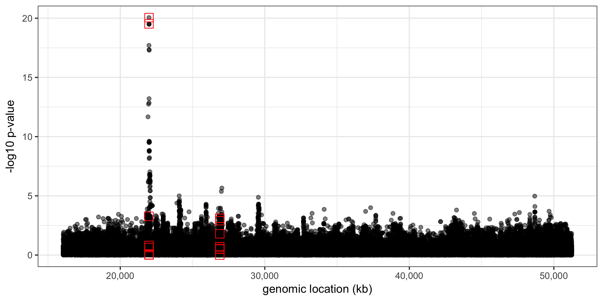
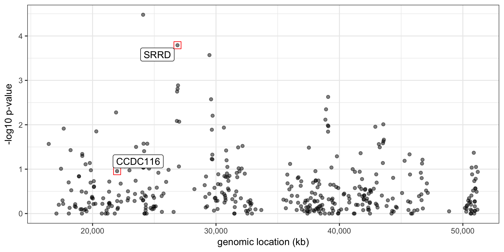

Data and sample codes can be found in [https://github.com/YPARK/6.881/tree/master/lab3](https://github.com/YPARK/6.881/tree/master/lab3)

# Option 1: Exploration of ExAC data

First of all, you are welcomed to work on the previous year's lab.  See [`Lab3-2016.pdf`](Lab3-2016.pdf) (courtesy of Yaping Liu).  You will find assignment in there.

# Option 2: Rare variant analysis

In this lab, we simulate phenotypes driven by low-frequency genetic
variants, and carry out genetic association tests on a set of SNPs,
aggregated in a gene level.


## Classification of variants based on MAF (minor allele frequency) 

Roughly we can classify genetic variants as follows.

- Common variants: MAF $\ge$ 5%
- Low frequency variants: 0.5% $\le$ MAF $<$ 5%
- Rare variants: MAF $\le$ 0.5%

Since we need large sample size to test genetic association on the
rare variants and we only have 1000 genomes project data (Lab 2), here
we just treat the low-frequency variants as rare variants.

## Challenges of rare variant analysis

Most genetic variants in human population are rare!

- A millions of common genetic variants create a large-scale multiple hypothesis problem, but there are even more rare variants than the common ones.

- Limited power of a single variant analysis, especially when it is rare.  Case/control studies may not have a sufficient number rare variants

- Presumably most non-coding rare variants mean nothing significant to disease phenotypes.

## Simulation of gene-level burden test

We used a subset of ExAC data to select causal genes in an informed way.

```
exac.subset <- read_tsv('ExAC_data.txt', col_types = exac.types) %>%
    filter(chr == 22) %>%
    mutate(syn.weights = n_syn / exp_syn,
           mis.weights = n_mis / exp_mis,
           lof.weights = n_lof / exp_lof) %>%
    as.data.frame()
```

As an example, we randomly select `n.causal.genes` number of causal
genes preferentially sampling on the genes with a high level of
synonymous mutation burdens.  You may sample with different criteria.

```
causal.gene.tab <- exac.subset %>%
    sample_n(size = n.causal.genes, weight = syn.weights)
```

We sample causal SNPs within each causal gene inversely proportional
to the MAF.

```
sample.snps.g <- function(g, .gene.tab, .snp.tab, n.snps) {
    g.start <- .gene.tab[g, 'tx_start'] %>% as.integer()
    g.end <- .gene.tab[g, 'tx_end'] %>% as.integer()

    ret <- .snp.tab %>%
        filter(snp.loc >= g.start, snp.loc <= g.end)

    if(nrow(ret) < 1) return(NULL)

    .n.snps <- min(nrow(ret), n.snps)

    ret <- ret %>%
        sample_n(size = .n.snps, weight = 1/maf)
}
```

Given the level of heritability `h2` we add non-genetic noise.

```
X.causal <- plink$BED[ , causal.snps.tab$pos] %>%
    scale(center = TRUE, scale = FALSE)

y.causal <- X.causal %*% rnorm.mat(nrow(causal.snps.tab), 1)

## Properly scale noise by heritability
var.genetic <- var(y.causal, na.rm = TRUE) %>% as.numeric()
var.noise <- var.genetic * (1/h2 - 1)
## should have h2 = var.genetic / (var.genetic + var.noise)

y.obs <- y.causal + rnorm.mat(nrow(y.causal), 1) * sqrt(var.noise)
```

## Gene-based aggregate analysis (example)

First, let us take a look at the SNP-level GWAS result, testing for each SNP $j$:
```
y.obs ~ X[, j] + 1
```



In this example, we simulated the data assuming two causal genes of
which 10 SNPs within each gene body are causally perturbed.  We were
able to identify one locus with a strong GWAS signal peak, but the
other seems not reach GWAS significance level.  It could be due to a
large fraction of low-MAF SNPs sampled among its true causal variants.

One way to boost the power of GWAS is to aggregate multiple weak
signals and concentrate them on biologically meaningful units (genes
and pathways).  Here we simply run [SKAT](https://cran.r-project.org/web/packages/SKAT/index.html), developed by Xihong Lin's group (see [https://www.hsph.harvard.edu/skat/](https://www.hsph.harvard.edu/skat/)).

```
skat.null <- SKAT_Null_Model(y.obs ~ 1, out_type = 'C')

run.skat.g <- function(g, xx, .gene.tab, .snp.tab, .skat.null) {
    require(SKAT)

    g.start <- .gene.tab[g, 'tx_start'] %>% as.integer()
    g.end <- .gene.tab[g, 'tx_end'] %>% as.integer()
    x.pos <- .snp.tab %>% filter(snp.loc >= g.start, snp.loc <= g.end) %>%
        select(pos) %>% unlist(use.names = FALSE) %>% as.integer()

    if(length(x.pos) < 1) return(NULL)

    skat.out <- SKAT(xx[ , x.pos, drop = FALSE], obj = .skat.null,
                     kernel = 'linear.weighted', method = 'SKATO',
                     is_dosage = TRUE)

    ret <- .gene.tab[g, ] %>% select(transcript, gene) %>%
        mutate(n.snps = skat.out$param$n.marker,
               p.val = skat.out$p.value)

    log.msg('Finished: %d, p-value = %.2e', g, ret$p.val)
    return(ret)
}
```



Using `SKAT` we were able to find the missing gene significant, but
unfortunately `SKAT` introduced several false positive genes.
Aggregation methods for weak GWAS signals are a quite popular topic in
statistical genetics.

## Assignment

1. Why do we need large sample size for rare variant analysis?

2. Run the same type of simulation and analysis using other aggregation methods, e.g., [C-alpha test](https://www.rdocumentation.org/packages/AssotesteR/versions/0.1-10/topics/CALPHA).

3. Discuss pros and cons of the aggregation methods for rare / weak genetic signals.

